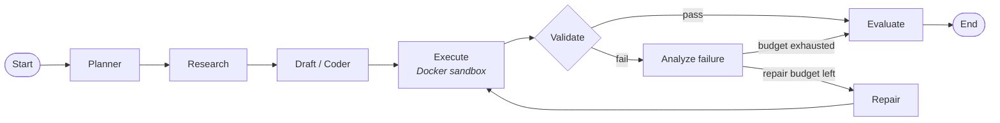

<div align="center">

# AgentEval

**Multi-agent reliability & evaluation platform**

Don't just ask *"did the agent succeed?"*: find out **where** it went wrong, **why**, and whether it recovered.

[](https://github.com/sampro14/agentval_system/actions/workflows/ci.yml)


[Quick start](#-quick-start) · [How it works](#-how-it-works) · [Dashboard](#-dashboard) · [API](#-api) · [Docs](#-documentation) · [Roadmap](#-roadmap)

</div>

---

## Why AgentEval?

Most agent benchmarks report a single number: *"task success rate: 82%."* That number can't tell you why the
other 18% failed. Was the plan wrong? Did the agent read the wrong files? Was the code buggy, the test
environment broken, or did a "fix" break something else? Each cause needs a different remedy.

AgentEval records every run as a full, observable **trajectory**:

```
Plan → Research → Draft → Execute → Validate → Diagnose → Repair → Re-execute → Evaluate
```

- **Every step is stored** as a structured event: output, latency, and token usage.
- **Ground truth comes from execution.** Generated code runs in an isolated Docker sandbox, and the pass/fail
  result comes from that run, not from the agent's own claim.
- **Failures are attributed.** Each failure gets a category and the responsible agent, decided by rules first
  and by an LLM only when the rules aren't confident.
- **Nothing is hidden behind one score.** The goal is a multi-dimensional reliability scorecard, not a single
  opaque number.

## ✨ Features

| | |
|---|---|
| 🧭 **Multi-agent workflow** | Planner, researcher, coder, executor, validator, failure analyzer and repairer, wired together with [LangGraph](https://github.com/langchain-ai/langgraph), including a bounded repair loop. |
| 🔒 **Sandboxed execution** | CPU, memory, PID and time limits, no network, and the container is removed after each run. Playwright tests get a separate headless-Chromium image. |
| ✅ **Evidence-first validation** | Checks based only on evidence (functional correctness, tests present, no regressions) run first. An LLM reviews coverage afterwards, and it can fail a run but never override a failing test. |
| 🩺 **Failure attribution** | Rule-based classifier with an LLM fallback (confidence < 0.8). Every failure records a category, the responsible agent, whether a rule or the model decided, and a recommended action. |
| 🔁 **Bounded repair loop** | Failed attempts are diagnosed and the coder is re-run with the failure record as feedback, up to a configurable limit. |
| 🔌 **Multiple LLM providers** | Anthropic, OpenAI, Gemini, DeepSeek, or an offline `fake` provider for demos and tests. Providers can be switched per run. |
| 📊 **Live dashboard** | Next.js UI to start runs, watch the pipeline progress, and inspect each agent's prompt, raw reply and result. |
| 🧪 **Fault injection** | Score the failure-handling agents against known-broken solutions with known answers, on separate dev and held-out splits. |

## 🧩 How it works



| Stage | What it does |
|---|---|
| **Planner** | Turns the task into a structured plan and requirements. |
| **Research** | Picks the files from the target codebase worth reading. Scored against a ground-truth list of needed and helpful files. |
| **Draft** | The coder writes the change and its tests. |
| **Execute** | Runs `compile`, then `pytest`, in the sandbox and produces a JUnit report with per-test results. A sandbox failure (for example a missing image) is recorded as evidence, not a crash. |
| **Validate** | Evidence checks, then an LLM review of requirement and test coverage. |
| **Analyze failure** | Attributes the failure to a category and the responsible agent. |
| **Repair** | Re-runs the coder with the failure record as feedback. |
| **Evaluate** | Scores the attempt against hidden acceptance tests and writes the report. |

<details>
<summary><b>Failure categories</b></summary>

`PLANNING` · `RETRIEVAL` · `CONTEXT` · `TOOL_SELECTION` · `TOOL_EXECUTION` · `CODE_GENERATION` · `VALIDATION` · `ENVIRONMENT` · `REPAIR` · `UNKNOWN`

Rules cover sandbox and environment errors, compile errors, missing tests, unavailable dependencies,
regressions after a repair, and requirements missing from the plan or the code.

</details>

### Benchmark tasks

Agents work against a small auth library (`authkit`, in [datasets/sample_app](datasets/sample_app)). Each task
has hidden acceptance tests and a list of the files an agent should find.

| Task | Difficulty | Focus |
|---|---|---|
| `change-password` | easy | single module, tests required |
| `email-validation` | easy | single module, tests required |
| `login-lockout` | medium | stateful logic, SQL migration |
| `delete-account` | medium | foreign keys |
| `login-form-validation` | medium | browser / Playwright |
| `password-reset` | hard | multi-file, SQL migration, tokens |

## 🚀 Quick start

**Requirements:** Python 3.12, [uv](https://docs.astral.sh/uv/), Node 20+, and Docker (running).

```bash
git clone https://github.com/sampro14/agentval_system.git
cd agentval_system

uv sync
cp .env.example .env                  # then edit it, see below
docker compose up -d postgres redis   # Postgres on host port 5433 (override with AGENTEVAL_PG_PORT)
docker compose build sandbox          # image that runs generated code
docker compose build sandbox-browser  # optional, ~2GB: only for the login-form task
uv run alembic upgrade head
```

In `.env`, set at least:

```bash
AGENTEVAL_LLM_PROVIDER=gemini         # anthropic | openai | gemini | deepseek | fake
GEMINI_API_KEY=...                    # the key for the provider you chose
AGENTEVAL_ENABLE_DEV_ENDPOINTS=true   # needed for the "One agent at a time" page
```

> **No API key?** Set `AGENTEVAL_LLM_PROVIDER=fake` to run the whole pipeline offline with canned responses.

Then start three processes, each in its own terminal:

```bash
uv run uvicorn agenteval.apps.api.main:app --port 8001   # A: the API
uv run python -m agenteval.workers.run_worker            # B: runs the agents
cd apps/web && npm install && npm run dev                # C: the dashboard
```

Open **http://localhost:3000**, pick a task and a provider, press **Start run**, and watch the steps appear.

<details>
<summary>Notes on ports, the worker, and resetting</summary>

- The API uses port 8001 because 8000 is often taken. If you change it, set `NEXT_PUBLIC_API_URL` for the dashboard.
- The worker runs on the host rather than in Compose because it bind-mounts per-run workspaces into sibling sandbox containers.
- To wipe everything and start over (destroys the local database): `docker compose down -v`, then `rm -rf .agenteval-dev /tmp/agenteval`.

</details>

## 🖥 Dashboard

| Page | What it shows |
|---|---|
| **Runs** | Start a run with a chosen task and provider, and watch the pipeline advance stage by stage. |
| **Run detail** | The full trajectory as a timeline: each event's output, latency, tokens, failures and repairs. |
| **One agent at a time** | Runs a single agent on a task and shows its prompt, raw reply and result. Each agent continues from the previous agent's saved output. |

## 🔌 API

Base path `/api/v1`.

| Method | Endpoint | Description |
|---|---|---|
| `POST` | `/runs` | Create a run (`202 Accepted`) |
| `GET` | `/runs` | List runs |
| `GET` | `/runs/{id}` | Get a run |
| `GET` | `/runs/{id}/trajectory` | Every event in the run |
| `GET` | `/runs/{id}/failures` | Attributed failures |
| `GET` | `/runs/{id}/evaluation` | Evaluation results |
| `GET` | `/tasks` | Available benchmark tasks |
| `GET` | `/providers` | Configured LLM providers |

```bash
curl -X POST localhost:8001/api/v1/runs -H 'content-type: application/json' \
  -d '{"task_id": "change-password", "provider": "gemini"}'
curl localhost:8001/api/v1/runs/<id>/trajectory
```

## 🛠 Command-line tools

```bash
# Run one agent on one task, and print everything it did
uv run python -m agenteval.dev.stage planner --task password-reset
uv run python -m agenteval.dev.stage research --task password-reset   # continues from the planner's saved state
uv run python -m agenteval.dev.stage planner --task all --brief       # every task, compact table

# Score the failure-handling agents against known-broken solutions
uv run python -m agenteval.dev.faults validate                        # dev split (safe to tune on)
uv run python -m agenteval.dev.faults validate --split heldout        # only for the final check
uv run python -m agenteval.dev.faults validate --case da-no-tests --repeat 3
```

The fault suite has 22 cases: deliberate single faults (a missing migration, a plaintext token, a wrong
lockout threshold, a syntax error, an infinite loop, and so on) and untouched controls. The planner, research
and coder LLM calls are skipped, and the real executor runs in the real sandbox.

## 🏗 Project structure

```
agenteval/
├── agents/          planner, researcher, coder, executor, validator, failure_analyzer, repairer
├── orchestration/   LangGraph workflow, shared state, repair policy
├── execution/       Docker sandbox, workspaces, compile/pytest checks, JUnit reports
├── evaluation/      retrieval, draft and acceptance scoring, run report
├── llm/             provider layer (Anthropic, OpenAI, Gemini, DeepSeek, fake)
├── observability/   trajectory events and tracing
├── storage/         SQLAlchemy models, repositories, Alembic migrations (Postgres)
├── workers/         Redis-backed run worker
├── apps/api/        FastAPI app and routes
└── dev/             single-agent stage runner and fault-injection harness
apps/web/            Next.js dashboard
datasets/            sample app, tasks, reference solutions, acceptance tests, fault cases
docs/                system design and learning guide
tests/               pytest suite
```

## 🧪 Development

```bash
uv run ruff check . && uv run ruff format --check .
uv run mypy agenteval
uv run pytest
```

The tests use SQLite and scripted fake LLM and sandbox classes, so they need no API key. The Docker
integration tests run only when the matching sandbox images are built. CI builds the base image but not the
browser image.

## 📚 Documentation

- [docs/system-design.md](docs/system-design.md): the full design and vision (agents, metrics, reliability score, data model).
- [docs/LEARNING.md](docs/LEARNING.md): a walkthrough of the code that exists today and why it is built this way.

## 🗺 Roadmap

- [x] **1. Core runtime**: FastAPI, LangGraph workflow, Docker sandbox, Postgres storage, Redis worker, LLM providers
- [x] **2. Validation**: pytest and Playwright execution, validator agent, failure analyzer
- [x] **5. UI** (partial): Next.js dashboard with run and trajectory viewers
- [ ] **3. Evaluation**: stage-level metrics engine, reliability scorecard, OpenTelemetry tracing
- [ ] **4. Recovery**: targeted repair agent, retry policy, recovery metrics
- [ ] **6. Research**: benchmark dataset, baselines, ablation studies

## 📄 License

Released under the [MIT License](LICENSE).
